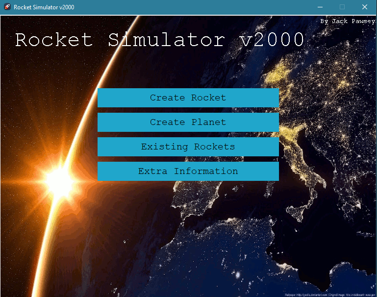
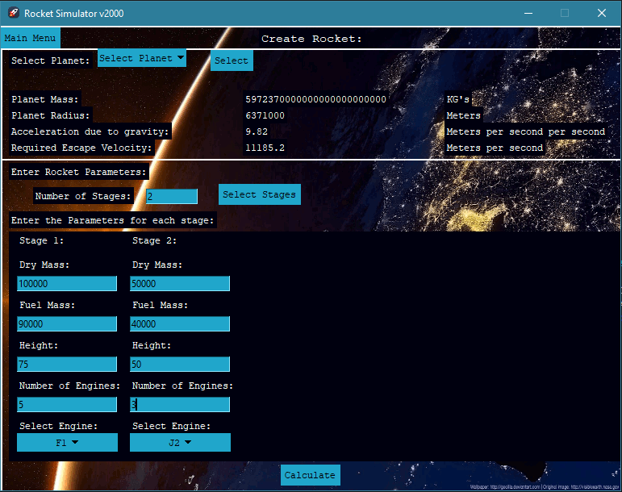
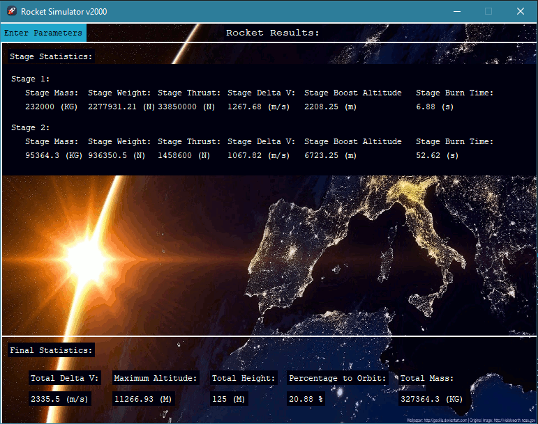
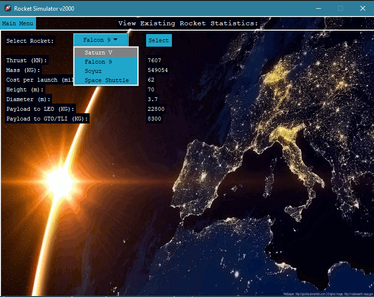
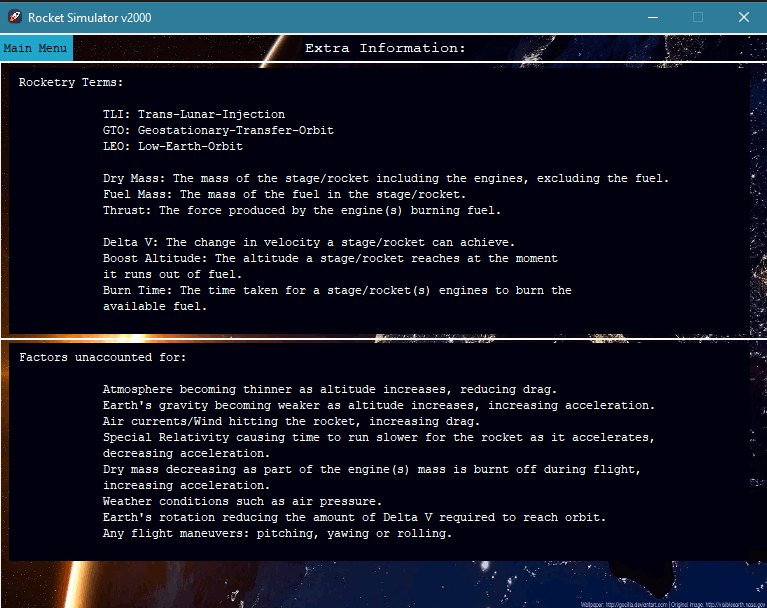

# PROG-RocketSimulator
First year uni programming project

My first ever program :)

## Getting started

pip install tkinter

## About
This is a desktop Python application using tkinter for the GUI

It allows you to create planets and rockets by inputting various parameters and then calculates the performance your rocket would have e.g. percentage to orbit

## Usage
Define a planet by specifying it's name, mass and radius

Select the planet you want to launch from, enter parameters to create a rocket then click Calculate.

There is some file handling (e.g. pickling planet data) that is present just for uni coursework reasons

### Main page

### Define rockets

### Performance results

### Define planets

### View rockets

### Extra info

